[](https://github.com/ckesanapalli/surface-mesher/actions/workflows/python-package.yml/badge.svg)
[](https://coveralls.io/github/ckesanapalli/surface-mesher?branch=master)
[](LICENSE.txt)
[](https://www.python.org/downloads/)
[](https://pypi.org/project/surfmesh/)
[](https://doi.org/10.5281/zenodo.15298588)


<p align="center">
  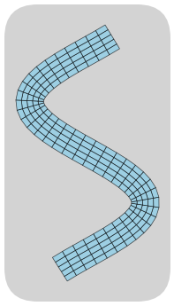
</p>

# **SurfMesh** - A Surface Meshing Python Library

**SurfMesh** is a Python library for generating structured 3D surface meshes of primitive shapes, with a strong focus on **quadrilateral-dominant (quad) meshing**. The meshes are particularly suited for **visualization** and **Boundary Element Method (BEM)** simulations.

> ⚠️ This project is currently under active development.

---

## 🎯 Objective

This library aims to provide a minimal, intuitive interface for constructing **quad-based surface meshes** of primitive solids.

Use cases include:

- Geometry visualization
- Boundary Element Methods (BEM)
- Educational tooling
- Preprocessing for surface-based solvers

---

## ⚙️ Requirements

- **Python**: >= 3.10
- **Dependencies**:
  - `numpy>=1.24`
  - Optional (for examples and visualization):
    - `ipykernel`
    - `jupyterlab`
    - `matplotlib`

---

## 🚀 Installation

To install stable version via PyPI:

```bash
pip install surfmesh
```

For the latest development version via Git:

```bash
pip install git+https://github.com/ckesanapalli/surface-mesher.git
```

---

## 🧱 Basic Usage

Below are examples of how to use the library to generate and visualize meshes.


```python
from pathlib import Path

import numpy as np
import matplotlib.pyplot as plt
from matplotlib.patches import Polygon
from matplotlib.collections import PatchCollection, PolyCollection
from mpl_toolkits.mplot3d.art3d import Poly3DCollection

import surfmesh as sm

plot_res = (4, 4)
FACE_COLOR = "skyblue"
```

## 1. Mesh Between Two Edges


```python
# Define two edges
x = np.linspace(0, np.pi / 2, 20)
edge1 = np.array([x[2:], np.sin(x[2:])])
edge2 = np.array([x[:-2], np.exp(x[:-2])])

# Generate the mesh
radial_resolution = 10
mesh = sm.mesh_between_edges([edge1, edge2], radial_resolution)

print(f"Generated mesh with {mesh.shape[0]} quadrilateral faces.")

fig, ax = plt.subplots(figsize=plot_res)
collection = PatchCollection(map(Polygon, mesh), facecolor=FACE_COLOR, edgecolor='k', linewidth=0.3)
ax.add_collection(collection)
ax.set_xlim(mesh[:, :, 0].min() - 0.1, mesh[:, :, 0].max() + 0.1)
ax.set_ylim(mesh[:, :, 1].min() - 0.1, mesh[:, :, 1].max() + 0.1)
ax.set_title("Mesh Between Edges")
plt.show()
```

    Generated mesh with 170 quadrilateral faces.
    


    
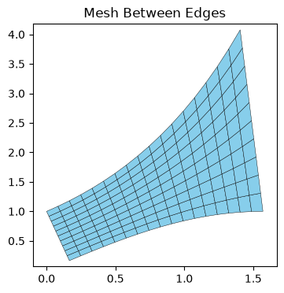
    


## 2. Radial Disk Mesh


```python
# Parameters for the radial disk mesh
radius = 1.0
radial_resolution = 10
segment_resolution = 20

# Generate the radial disk mesh
radial_mesh = sm.disk_mesher_radial(radius, radial_resolution, segment_resolution)

print(f"Generated radial disk mesh with {radial_mesh.shape[0]} quadrilateral faces.")

fig, ax = plt.subplots(figsize=plot_res)
patches = [Polygon(face, closed=True) for face in radial_mesh]
collection = PatchCollection(patches, facecolors=FACE_COLOR, edgecolors="k", alpha=0.7)
ax.add_collection(collection)

ax.set_xlim(-radius, radius)
ax.set_ylim(-radius, radius)
ax.set_aspect("equal")
ax.set_title("Radial Disk Mesh")
plt.show()
```

    Generated radial disk mesh with 200 quadrilateral faces.
    


    
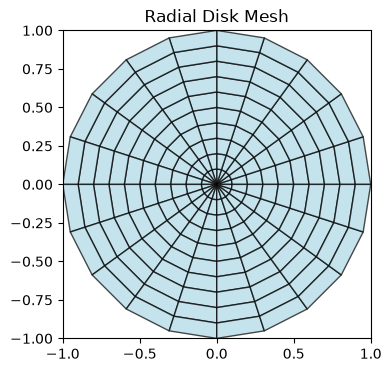
    


## 3. Square-Centered Disk Mesh


```python
radius = 1.0
square_resolution = 5
radial_resolution = 10
square_side_radius_ratio = 0.5

# Generate the square-centered disk mesh
square_centered_mesh = sm.disk_mesher_square_centered(radius, square_resolution, radial_resolution, square_side_radius_ratio)

print(f"Generated square-centered disk mesh with {square_centered_mesh.shape[0]} quadrilateral faces.")

fig, ax = plt.subplots(figsize=plot_res)
collection = PatchCollection(map(Polygon, square_centered_mesh), facecolors=FACE_COLOR, edgecolors="k", alpha=0.7)
ax.add_collection(collection)

ax.set_xlim(-radius, radius)
ax.set_ylim(-radius, radius)
ax.set_aspect("equal")
ax.set_title("Square-Centered Disk Mesh")
plt.show()
```

    Generated square-centered disk mesh with 225 quadrilateral faces.
    


    
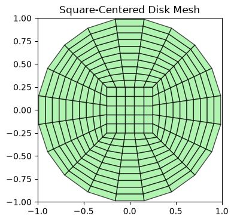
    


## 4. Cuboid Mesh using Explicit Coordinates


```python
# Define coordinate arrays for a cuboid
x_coords = [0.0, 1.0, 2.0]
y_coords = [0.0, 1.0, 2.0]
z_coords = [0.0, 0.5, 1.0]

# Generate the cuboid surface mesh
faces = sm.cuboid_mesher(x_coords, y_coords, z_coords)

print(f"Generated {faces.shape[0]} quadrilateral faces.")
print(faces.shape)

fig = plt.figure(figsize=plot_res)
ax = fig.add_subplot(111, projection="3d")

# Add each quad to the 3D plot
poly = Poly3DCollection(faces, facecolors=FACE_COLOR, edgecolors="k", alpha=0.7)
ax.add_collection3d(poly)

ax.set_xlabel("X")
ax.set_ylabel("Y")
ax.set_zlabel("Z")
ax.set_title("Cuboid Surface Mesh")
plt.tight_layout()
plt.show()
```

    Generated 24 quadrilateral faces.
    (24, 4, 3)
    


    
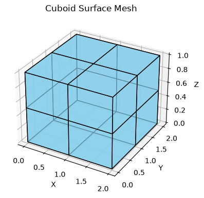
    


## 5. Cuboid Mesh using Resolution


```python
# Generate a cuboid mesh with resolution
length, width, height = 2.0, 1.0, 1.0
resolution = (4, 2, 2)

mesh = sm.cuboid_mesher_with_resolution(length, width, height, resolution=resolution)

print(f"Generated cuboid with {mesh.shape[0]} quadrilateral faces.")
print(mesh.shape)

fig = plt.figure(figsize=plot_res)
ax = fig.add_subplot(111, projection="3d")

poly = Poly3DCollection(mesh, facecolors=FACE_COLOR, edgecolors="k", alpha=0.6)
ax.add_collection3d(poly)

ax.set_xlabel("X")
ax.set_ylabel("Y")
ax.set_zlabel("Z")
ax.set_title("Cuboid Mesh with Resolution")
plt.tight_layout()
plt.show()
```

    Generated cuboid with 40 quadrilateral faces.
    (40, 4, 3)
    


    
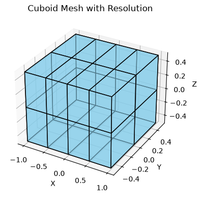
    


## 6. Revolve a Curve Along a Circular Path


```python
# Sample 2D curve coordinates
x = np.linspace(0, 1, 20)
z = x ** 2  # Example curve (parabola)

curves = np.array([x, z]).T
# Revolve the curve
segment_resolution = 20
faces = sm.circular_revolve(curves, segment_resolution, start_angle=0, end_angle=2*np.pi)

# Plotting
fig = plt.figure(figsize=plot_res)
ax = fig.add_subplot(111, projection='3d')
ax.add_collection3d(Poly3DCollection(faces, facecolors=FACE_COLOR, edgecolors="k", linewidths=1, alpha=0.5))
ax.set_xlim(-x.max(), x.max())
ax.set_ylim(-x.max(), x.max())
ax.set_zlim(z.min(), z.max())
ax.set_xlabel('X-axis')
ax.set_ylabel('Y-axis')
ax.set_zlabel('Z-axis')
plt.show()
```


    
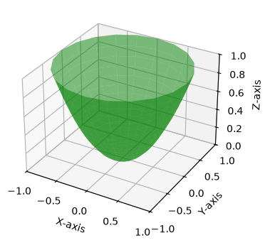
    


## 7. Revolve a Curve Along a Custom Path


```python
x = np.linspace(1, 10, 10)
z = np.log(x)
main_curve = np.array([x, z]).T

angle_rad = np.linspace(0, 4*np.pi, 30)
radius = angle_rad/10
revolve_path = np.array([angle_rad, radius]).T

revolved_mesh = sm.revolve_curve_along_path(main_curve, revolve_path)

fig = plt.figure(figsize=plot_res)
ax = fig.add_subplot(111, projection='3d')
ax.add_collection3d(Poly3DCollection(revolved_mesh, facecolors=FACE_COLOR, edgecolors="k", alpha=0.5))
ax.set_xlim(-x.max(), x.max())
ax.set_ylim(-x.max(), x.max())
ax.set_zlim(z.min(), z.max())
plt.show()
```


    
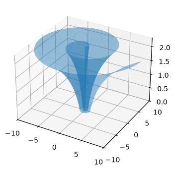
    


## 8. Generate a Radial Cylinder Mesh


```python
radius = 1.0
height = 2.0
radial_resolution = 8
segment_resolution = 16
height_resolution = 10

# Generate the cylinder mesh
mesh = sm.cylinder_mesher_radial(radius, height, radial_resolution, segment_resolution, height_resolution)

print(f"Generated a Radial Cylinder Mesh {mesh.shape[0]}.")
print(mesh.shape)

fig = plt.figure(figsize=plot_res)
ax = fig.add_subplot(111, projection="3d")

poly = Poly3DCollection(mesh, facecolors=FACE_COLOR, edgecolors="k", alpha=0.6)
ax.add_collection3d(poly)

ax.set_xlabel("X")
ax.set_ylabel("Y")
ax.set_zlabel("Z")
ax.set_title("Radial Cylinder Mesh")
plt.tight_layout()
plt.show()
```

    Generated a Radial Cylinder Mesh 416.
    (416, 4, 3)
    


    
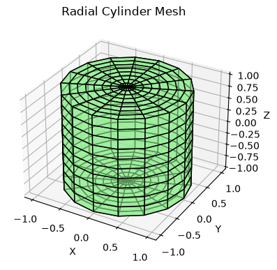
    


## 9. Generate a Square-Centered Cylinder Mesh


```python
radius = 1.0
height = 2.0
radial_resolution = 8
half_square_side_resolution = 4
height_resolution = 10

# Generate the cylinder mesh
mesh = sm.cylinder_mesher_square_centered(radius, height, radial_resolution, half_square_side_resolution, height_resolution)

print("Generated a Square-Centered Cylinder Mesh.")
print(mesh.shape)

fig = plt.figure(figsize=plot_res)
ax = fig.add_subplot(111, projection="3d")

poly = Poly3DCollection(mesh, facecolors=FACE_COLOR, edgecolors="k", alpha=0.6)
ax.add_collection3d(poly)

ax.set_xlabel("X")
ax.set_ylabel("Y")
ax.set_zlabel("Z")
ax.set_title("Square-Centered Cylinder Mesh")
plt.tight_layout()
plt.show()
```

    Generated a Square-Centered Cylinder Mesh.
    (960, 4, 3)
    


    
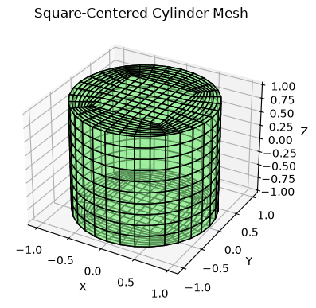
    


## 10. Generate a Sphere Mesh Using Cube Projection


```python
mesh = sm.sphere_mesher_from_projection(radius=1.0, resolution=10)

print("Generated a Sphere Mesh from Cube Projection.")
print(mesh.shape)

fig = plt.figure(figsize=plot_res)
ax = fig.add_subplot(111, projection="3d")

poly = Poly3DCollection(mesh, facecolors=FACE_COLOR, edgecolors="k", alpha=0.6)
ax.add_collection3d(poly)

ax.set_xlabel("X")
ax.set_ylabel("Y")
ax.set_zlabel("Z")
ax.set_title("Sphere Mesh from Cube Projection")
plt.tight_layout()
plt.show()
```

    Generated a Sphere Mesh from Cube Projection.
    (600, 4, 3)
    


    
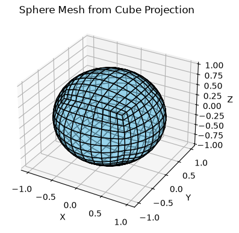
    


## 11. Generate a Sphere Mesh Using Radial Divisions


```python
radius = 1.0
radial_resolution = 20
segment_resolution = 20
mesh = sm.sphere_mesher_from_radial(radius, radial_resolution, segment_resolution)

print("Generated a Radial Sphere Mesh.")
print(mesh.shape)

fig = plt.figure(figsize=plot_res)
ax = fig.add_subplot(111, projection="3d")

poly = Poly3DCollection(mesh, facecolors=FACE_COLOR, edgecolors="k", alpha=0.6)
ax.add_collection3d(poly)

ax.set_xlabel("X")
ax.set_ylabel("Y")
ax.set_zlabel("Z")
ax.set_title("Sphere Mesh from Radial Sphere")
plt.tight_layout()
plt.show()
```

    Generated a Radial Sphere Mesh.
    (400, 4, 3)
    


    
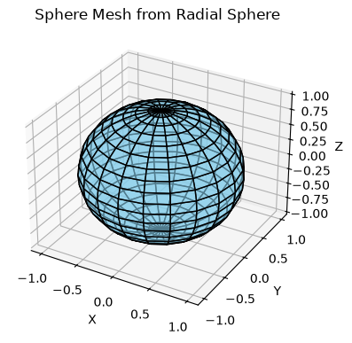
    


## 12. Extract Faces and Vertices from the mesh


```python

radius = 1.0
radial_resolution = 20
segment_resolution = 20
mesh = sm.sphere_mesher_from_radial(radius, radial_resolution, segment_resolution)

vertices, faces = sm.extract_vertices_faces(mesh.round(6))

print(f"Generated a Radial Sphere Mesh with {faces.shape[0]} faces and {vertices.shape[0]} vertices.")
print(f"Vertices shape: {vertices.shape}, Faces shape: {faces.shape}")
print(f"First 5 vertices:\n{vertices[:5]}")
print(f"First 5 faces:\n{faces[:5]}")

```

    Generated a Radial Sphere Mesh with 400 faces and 382 vertices.
    Vertices shape: (382, 3), Faces shape: (400, 4)
    First 5 vertices:
    [[-1.        0.        0.      ]
     [-0.987688  0.       -0.156434]
     [-0.987688  0.        0.156434]
     [-0.951057 -0.309017  0.      ]
     [-0.951057  0.       -0.309017]]
    First 5 faces:
    [[233 235 190 190]
     [269 278 235 233]
     [295 297 278 269]
     [315 328 297 295]
     [337 339 328 315]]
    

## 13. Create a Curvilinear Mesh from Four Edges

Generate a structured quadrilateral mesh over a 4-sided curvilinear panel
using a bilinearly-blended Coons patch (transfinite interpolation) --
dimension-agnostic: works unchanged for 2D (x, y) or 3D (x, y, z) points,
inferred from what the boundary curve functions return.

## 2D Curvilinear Surface


```python
def bottom(t: np.ndarray) -> np.ndarray:
    return np.c_[t, 0.4 * np.sin(2*np.pi * t)]

def top(t: np.ndarray) -> np.ndarray:
    return np.c_[t, 0.4 * np.sin(np.pi * t) + 1.0]

def left(t: np.ndarray) -> np.ndarray:
    return np.c_[np.zeros_like(t), t]

def right(t: np.ndarray) -> np.ndarray:
    return np.c_[np.ones_like(t), t]

grid, faces = sm.coons_patch(bottom, top, left, right, nu=24, nv=16)
fig = plt.figure(figsize=plot_res)
ax = fig.add_subplot(111)
ax.add_collection(PolyCollection(faces, facecolors=FACE_COLOR, edgecolors="k", alpha=0.6))
pts = grid.reshape(-1, 2)
ax.set_xlim(pts[:, 0].min(), pts[:, 0].max())
ax.set_ylim(pts[:, 1].min(), pts[:, 1].max())
ax.set_xlabel("X")
ax.set_ylabel("Y")
plt.tight_layout()
plt.show()

```


    

    


```python
from matplotlib.patches import FancyBboxPatch

A, W = 0.25, 0.06  # sine amplitude, ribbon half-width
ang_freq = 2.3 * np.pi  # sine angular frequency
phase = -0.5
def c(t):
    return np.c_[A * np.sin(ang_freq * t + phase), t]  # centerline

def n(t):
    return (lambda d: np.c_[-d[:, 1], d[:, 0]] / np.linalg.norm(d, axis=1, keepdims=True))(
    np.c_[A * ang_freq * np.cos(ang_freq * t + phase), np.ones_like(t)]
)

inner, outer = lambda t: c(t) - W * n(t), lambda t: c(t) + W * n(t)

def cap(a, b):
    return lambda v: a[None] * (1 - v[:, None]) + b[None] * v[:, None]
 
grid, faces = sm.coons_patch(inner, outer, cap(inner(np.zeros(1))[0], outer(np.zeros(1))[0]),
                           cap(inner(np.ones(1))[0], outer(np.ones(1))[0]), nu=40, nv=5)
 

dim = grid.shape[-1]
pts = grid.reshape(-1, dim)

x_min, x_max = pts[:, 0].min(), pts[:, 0].max()
y_min, y_max = pts[:, 1].min(), pts[:, 1].max()

fig, ax = plt.subplots(figsize=(7, 7))


ax.add_collection(
    PolyCollection(
        list(faces),
        facecolors=FACE_COLOR,
        edgecolors="k",
        alpha=0.7,
        zorder=2,
    )
)

# Round the outer plot box to soften the rectangular outline
pad = 0.08
x0 = x_min - pad * (x_max - x_min)
y0 = y_min - pad * (y_max - y_min)
dx = (x_max - x_min) * (1 + 2 * pad)
dy = (y_max - y_min) * (1 + 2 * pad)
rounding_size = 0.2 * min(dx, dy)

bg = FancyBboxPatch(
    (x0, y0),
    dx,
    dy,
    boxstyle=f"round,pad=0,rounding_size={rounding_size}",
    facecolor="lightgray",
    edgecolor="none",
    zorder=0,
)
ax.add_patch(bg)
 
ax.set_xlim(x0, x0 + dx)
ax.set_ylim(y0, y0 + dy)
ax.set_frame_on(False)
ax.set_aspect("equal")
ax.set_xticks([])
ax.set_yticks([])

plt.tight_layout()
plt.savefig("../README_files/logo.png", bbox_inches="tight", dpi=50, transparent=True)
plt.show()

```


    
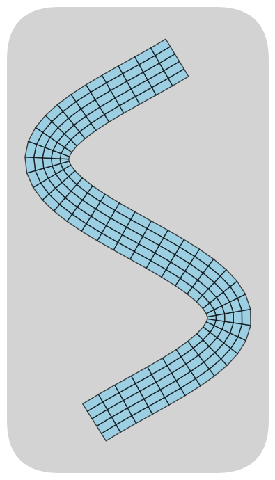
    


## 3D Curvilinear Surface


```python
def bottom(t: np.ndarray) -> np.ndarray:
    return np.c_[t, np.zeros_like(t), 0.3 * np.sin(np.pi * t)]

def top(t: np.ndarray) -> np.ndarray:
    return np.c_[t, 2 * np.ones_like(t), 0.5 * np.sin(np.pi * t) + 0.4]

def left(t: np.ndarray) -> np.ndarray:
    return np.c_[np.zeros_like(t), 2 * t, 0.4 * t]

def right(t: np.ndarray) -> np.ndarray:
    return np.c_[np.ones_like(t), 2 * t**5, 0.3 * np.sin(np.pi * t) + 0.4 * t]

grid, faces = sm.coons_patch(bottom, top, left, right, nu=24, nv=16)
fig = plt.figure(figsize=plot_res)
ax = fig.add_subplot(111, projection="3d")
ax.add_collection3d(Poly3DCollection(faces, facecolors=FACE_COLOR, edgecolors="k", alpha=0.6))
pts = grid.reshape(-1, 3)
ax.set_xlim(pts[:, 0].min(), pts[:, 0].max())
ax.set_ylim(pts[:, 1].min(), pts[:, 1].max())
ax.set_zlim(pts[:, 2].min(), pts[:, 2].max())
ax.set_xlabel("X")
ax.set_ylabel("Y")
ax.set_zlabel("Z")
plt.tight_layout()
plt.show()

```


    
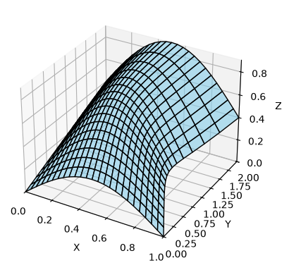
    


## Citation
If you use this library in your research, please consider citing the following citation: [CITATION.bib](CITATION.bib)


```python
from urllib.request import urlopen
from pathlib import Path

url = "https://zenodo.org/records/22911870/export/bibtex"
content = urlopen(url).read().decode("utf-8")
Path("../CITATION.bib").write_text(content, encoding="utf-8")
print(content)
```

    @software{chaitanya_kesanapalli_2026_22911870,
      author       = {Chaitanya Kesanapalli},
      title        = {SurfMesh},
      month        = sep,
      year         = 2026,
      publisher    = {Zenodo},
      version      = {v0.4.0},
      doi          = {10.5281/zenodo.22911870},
      url          = {https://doi.org/10.5281/zenodo.22911870},
      swhid        = {swh:1:dir:fa037fd4b26ea5fbdca13f2256bf1d20b3204dec
                       ;origin=https://doi.org/10.5281/zenodo.15298035;vi
                       sit=swh:1:snp:9329af0acb347cf3615c0f76e34741e57cb6
                       3675;anchor=swh:1:rel:acd411e4e964088eaf0d57ee95bf
                       db27ff7814e6;path=ckesanapalli-surfmesh-5d8ef5b
                      },
    }
    

## 📌 Roadmap

- [x] Cuboid surface mesh generation
- [x] Disk face mesh generation
- [x] Revolve curve mesh generation
- [x] Cylinder, and sphere support
- [x] Curvilinear mesh
- [ ] STL/PLY export support
- [ ] Mesh visualization utilities
- [ ] Export to BEM-compatible formats


